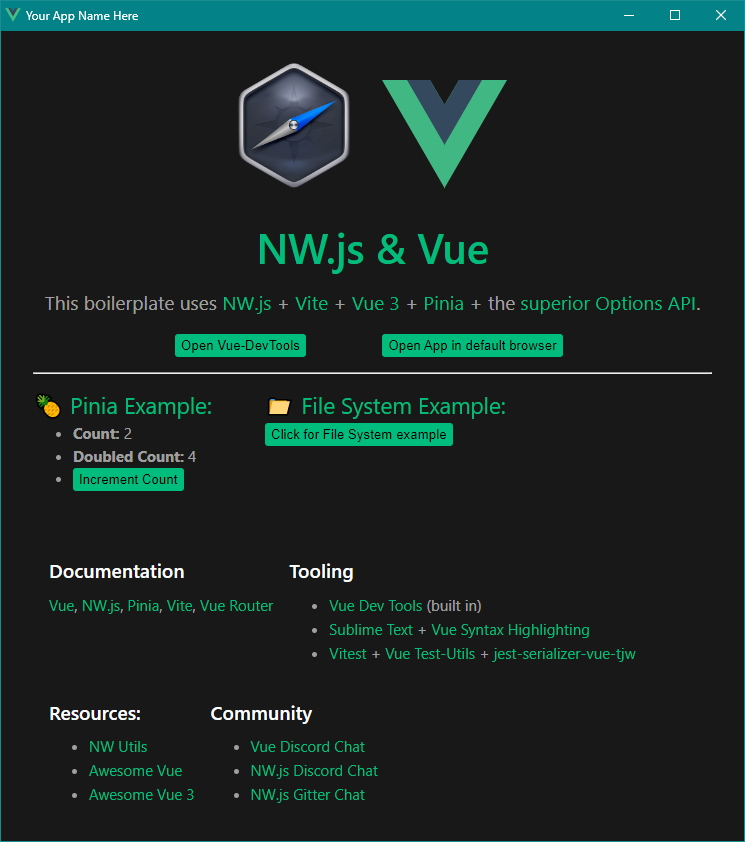

# NW.js + Vue 3 Desktop App Boilerplate




* * *


## WIP

This boilerplate is still in progress and not ready for production use yet (wait for v1.0.0+).


* * *


## High level boilerplate features

* **Vue 3** - Frontend framework
* **NW.js** - Desktop App runtime environment
  * Chromium 101
  * Node.js 17.8.0
* **Vue-DevTools** (latest) - Built in to the Chromium dev tools
* **Vite** - Dev Server/Bundler/App build tool
* **Pinia** - Global State Management
* **Options API** - Component organizational structure
* **ESLint** - Code error prevention and stylistic consistency
  * Vue Linting
  * A11Y Linting
  * Jest Linting
  * Import Linting
* **Vitest** - Vite-based Unit/integration/behavioral testing
  * @vue/test-utils - Test helpers for interacting with Vue in tests
  * jest-serializer-vue-tjw - Dramatically improved snapshot formatting
  * @pinia/testing - Initialize Pinia in tests


## Documentation

In all `.vue` components, you have access to `nw`, `global`, `process`, `require`, and the boolean `isDesktop`:

```js
methods: {
  example: function () {
    if (this.isDesktop) {
      console.log('Your OS is ' + this.process.platform);
      console.log('Your AppData location is ' + this.nw.App.dataPath);
      // Sets a value on Node's global, meaning other windows have access to this data.
      this.global.cow = 'moo';
      // The contents of the current directory
      console.log(this.require('fs').readdirSync('.'));
    }
  }
}
```

Or even directly from the template (with some slight changes to work within the Vue context):
```html
<div v-if="isDesktop">
  Your OS is {{ process.platform }}.
  Your AppData location is {{ nw.App.dataPath }}.
  <button @click="nw.global.cow = 'moo'">
    Clicking this button sets a value on Node's global.
    Meaning other windows have access to this data.
  </button>
  The contents of the current directory are {{ nw.require('fs').readdirSync('.') }}.
</div>
```


## Running locally

1. Download/Fork/Clone repo
1. Install a Node version manager:
   * [volta.sh](https://votla.sh) - Win/Lin/OSX
   * [nvm](https://github.com/nvm-sh/nvm) - Lin/OSX
1. Install Node 19.0.0
1. Run `npm install`
1. Run `npm start`


## Lint

Uses rules in `./eslint.json`

1. `npm run lint` to see linting errors
1. `npm run fix` to auto-fix linting errors where possible


## Tests

1. `npm t` runs all unit tests and shows coverage output
1. `npm t -- -u` runs all unit tests, updating snapshots (use with care)


## Building for distribution

1. `npm run build:clean` will delete your `./dist` and `./dist-vue` folders
1. `npm run build:vue` will build just your Vue app for web distribution (`./dist-vue`)
1. `npm run build:nw` will build just your NW.js app (`./dist`) for all supported platforms (Windows, OSX, Linux 32-Bit, Linux 64-Bit)
1. `npm run build` is your all-in-one command. It will clean out the old dist folders and build your Vue and NW.js app


## Removing Pinia

I set up Pinia in this project to save you time (and because it's amazing). If you don't need global state management for your project, you can remove Pinia by doing the following:

* Delete the `/src/store` folder and its contents
* Delete `/src/components/PiniaDemo.vue`
* Delete `/tests/unit/components/PiniaDemo.test.js`
* Remove the lines of code from `/src/App.vue` that contain the text "PiniaDemo"
* Remove the lines of code from `/package.json` that say "pinia"
* Remove the lines of code from `/tests/unit/setup.js` that say "pinia"
* `npm install && npm t -- -u && git add -A && git commit -m "Removed Pinia"`


## Updating Vue-DevTools

When you first run `npm install`, you will get the latest stable Vue-DevTools. However, future `npm install`s will not re-download the latest Vue-DevTools.

To update your version of Vue-DevTools run `npm run update:vue-devtools`.

This will delete the existing version and download the latest version of Vue-DevTools, then apply tweaks for it to work in NW.js.


## Alternatives

* [nw-vue-cli-example](https://github.com/nwutils/nw-vue-cli-example) - Uses Vue-CLI, has Vue 2 and Vue 3 branches.
* [nwjs-vue](https://github.com/elegantweb/nwjs-vue) - Uses Vue-CLI 2
* [vue-desktop-basic](https://github.com/TheJaredWilcurt/vue-desktop-basic) - Does not use a build system at all, all `.vue` files run directly in the browser context


## Boilerplate maintainer notes

This is not for those *using* this repo, but for those *maintaining* it.

1. When updating the version of NW.js devDependency, also update these:
   * `package.json` devDeps, build nwVersion
   * `build.target` in `vite.config.js`
   * Update the Node version number in the README
1. Bump the version number, and all the npm scripts that reference the version number
1. Run `npm run regression` after updating dependencies or other major changes to verify builds still work correctly


